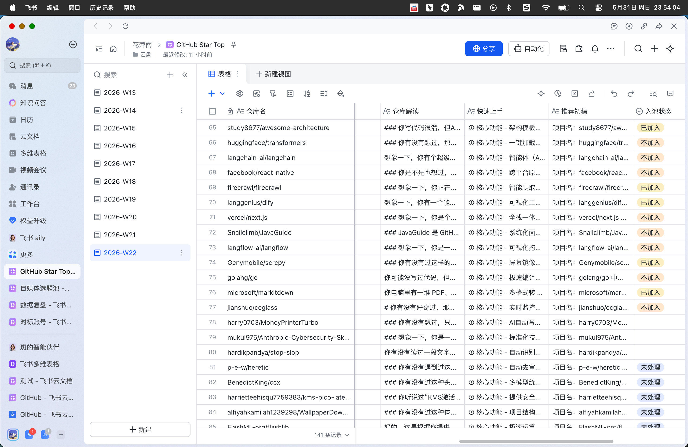
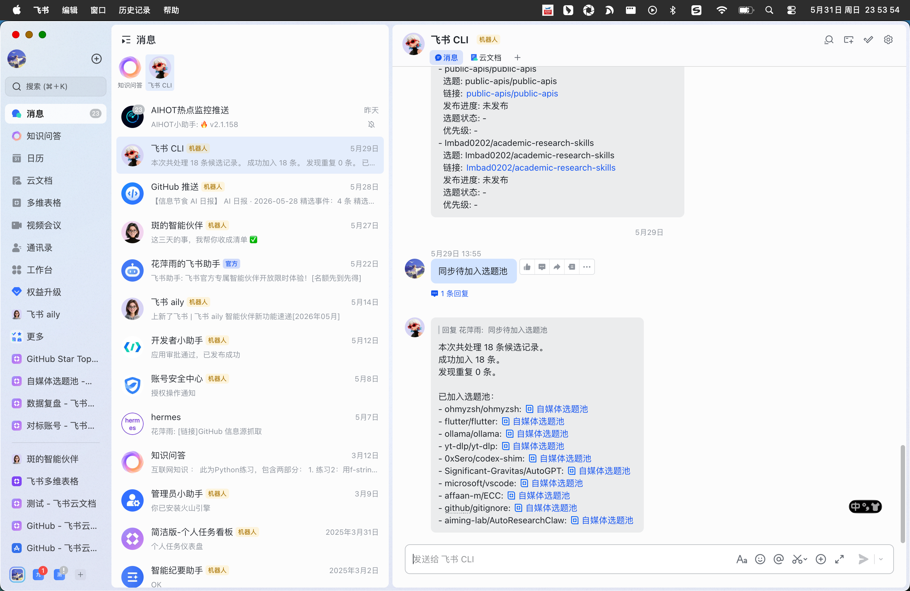
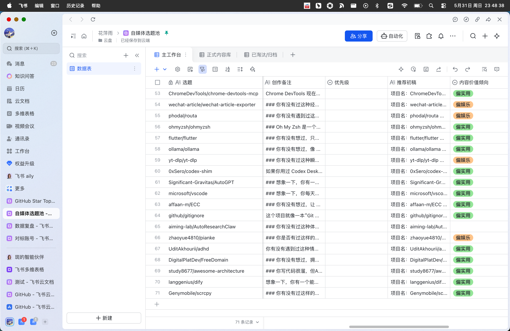

# GitHub Star Tracker

每天抓取 GitHub 上适合做内容选题的优质仓库，用 AI 生成仓库解读和推荐初稿，并按周写入飞书多维表格。

## 当前能力

- 每天通过 GitHub Actions 定时运行，也支持手动触发和本地 dry-run。
- `weekly` 默认采用 60/30/10 多源聚合：
  - 60% 来自 GitHub Trending 周榜
  - 30% 来自全站优质热门项目
  - 10% 来自新项目发现
- 对候选仓库做二层筛选：
  - 硬过滤模拟器、ROM、启动器、破解/预激活/资源分发、外挂/作弊类项目
  - 保留壁纸引擎、桌面宠物等可接受的娱乐项目
  - 按 stars、forks、活跃度、license、产品信号等重新排序
  - 对 prompt/skill、资源列表、营销味仓库做降权
- 去重策略：
  - 同一仓库本周内只写入一次
  - star 涨幅超过 500 时更新已有记录
  - 跨周保留 30 天冷却，减少连续多周重复出现
  - 默认通过 `--min-new 20` 尽量保证每轮至少 20 条历史未记录仓库
- 写入飞书时会抓取 README，并调用 DeepSeek 生成：
  - `仓库解读`
  - `快速上手`
  - `推荐初稿`
- 新写入记录的 `入池状态` 默认为单选项 `未处理`。
- 配套飞书 CLI 脚本可把 `GitHub Star Top` 中 `待加入选题池` 的记录同步到 `自媒体选题池`。

## 效果预览

### GitHub Star Top 周表



### 飞书 CLI 同步回复



### 自媒体选题池同步结果



## 飞书表结构

主表按 ISO 周自动分表，表名格式为 `YYYY-WXX`，例如 `2026-W21`。

| 字段 | 类型 | 说明 |
|------|------|------|
| 仓库名 | 文本 | `owner/repo` 格式 |
| 描述 | 文本 | 仓库原始描述 |
| Stars | 数字 | 当前 star 数 |
| Star 涨幅 | 数字 | 与本周上次记录的差值 |
| 语言 | 文本 | 主要编程语言 |
| 链接 | 超链接 | GitHub 仓库地址 |
| 首次入榜时间 | 文本日期 | 第一次被本项目记录的日期 |
| 最后更新时间 | 文本日期 | 最近一次写入或更新日期 |
| 仓库解读 | 文本 | AI 生成的口语化介绍 |
| 快速上手 | 文本 | AI 生成的结构化上手说明 |
| 推荐初稿 | 文本 | AI 生成的内容推荐草稿 |
| 入池状态 | 单选 | `未处理`、`待加入选题池`、`已加入`、`重复待确认` |
| 选题池记录 | 文本 | 同步到自媒体选题池后的目标记录引用 |

## 快速开始

### 1. 创建飞书应用

1. 打开飞书开放平台，创建一个自建应用。
2. 在权限管理中开启多维表格读写能力。
3. 记录 `App ID` 和 `App Secret`。

### 2. 准备飞书多维表格

1. 在飞书中创建一个多维表格文档。
2. 将飞书应用添加为文档协作者。
3. 从文档 URL 中获取 `app_token`，例如 `https://xxx.feishu.cn/base/<app_token>`。

### 3. 配置 GitHub Secrets

在 GitHub 仓库的 `Settings -> Secrets and variables -> Actions` 中添加：

| 名称 | 说明 |
|------|------|
| `FEISHU_APP_ID` | 飞书应用 ID |
| `FEISHU_APP_SECRET` | 飞书应用密钥 |
| `FEISHU_BITABLE_APP_TOKEN` | 飞书多维表格文档 ID |
| `DEEPSEEK_API_KEY` | DeepSeek API Key |

`GITHUB_TOKEN` 由 GitHub Actions 自动提供。

### 4. 运行工作流

进入 GitHub Actions 页面，选择 `GitHub Star Tracker`，手动执行 `Run workflow` 验证配置。

验证通过后，工作流会每天北京时间 `08:17` 自动运行。

## 本地运行

```bash
pip install -r requirements.txt
cp .env.example .env
```

编辑 `.env`，填入本地运行所需配置：

```bash
GITHUB_TOKEN=your_github_token_here
FEISHU_APP_ID=your_feishu_app_id_here
FEISHU_APP_SECRET=your_feishu_app_secret_here
FEISHU_BITABLE_APP_TOKEN=your_feishu_bitable_app_token_here
DEEPSEEK_API_KEY=your_deepseek_api_key_here
```

常用命令：

```bash
# 只抓取和去重，不写入飞书
python main.py --dry-run

# 正常 weekly 运行
python main.py --top 30 --period weekly --min-new 20

# 输出过滤明细，排查为什么某些仓库被过滤
python main.py --top 30 --period weekly --debug-filter --dry-run

# 按语言筛选
python main.py --top 20 --period weekly --lang python

# 临时指定 GitHub Token
python main.py --top 30 --period weekly --token "$GITHUB_TOKEN"

# 忽略去重，强制写入，主要用于本地验证内容展示
python main.py --top 5 --period weekly --force-write

# 同时导出本地文件
python main.py --top 30 --export json
python main.py --top 30 --export csv
```

## 参数说明

| 参数 | 默认值 | 说明 |
|------|--------|------|
| `--top` | 30 | 初始抓取数量 |
| `--min-new` | 20 | 至少补足多少条历史未记录仓库；不足时会扩大候选池 |
| `--period` | weekly | 时间范围：`today`、`weekly`、`monthly` |
| `--lang` | 不限 | 按编程语言筛选，如 `python`、`javascript` |
| `--export` | 不导出 | 导出本地文件：`json` 或 `csv` |
| `--dry-run` | 关闭 | 只抓取和去重，不写入飞书 |
| `--force-write` | 关闭 | 忽略去重并强制写入飞书 |
| `--debug-filter` | 关闭 | 输出被过滤仓库及过滤原因 |
| `--token` | 不传 | 临时覆盖 `.env` 中的 GitHub Token |

## 飞书选题池同步

仓库内置飞书 CLI 辅助脚本，位置在 `tools/feishu-cli/`。

同步规则：

- 扫描 `GitHub Star Top` 下所有周表。
- 只处理 `入池状态 = 待加入选题池` 的记录。
- 同步到 `自媒体选题池` 时，按 `仓库名` 或 `链接` 判断重复。
- 同步成功后，源记录更新为 `已加入`，并回写 `选题池记录`。
- 检测到重复时，源记录更新为 `重复待确认`，不会覆盖已有选题。

手动同步：

```bash
# 预演同步，不实际写入
node tools/feishu-cli/scripts/sync_github_star_top_to_topic_pool.js --dry-run

# 正式同步
node tools/feishu-cli/scripts/sync_github_star_top_to_topic_pool.js
```

消息触发：

```bash
# 临时启动监听机器人
node tools/feishu-cli/scripts/run_topic_pool_sync_bot.js

# 安装为 macOS launchd 常驻服务
chmod +x tools/feishu-cli/scripts/install_topic_pool_sync_bot_service.sh
tools/feishu-cli/scripts/install_topic_pool_sync_bot_service.sh

# 卸载常驻服务
chmod +x tools/feishu-cli/scripts/uninstall_topic_pool_sync_bot_service.sh
tools/feishu-cli/scripts/uninstall_topic_pool_sync_bot_service.sh
```

安装常驻服务后，给飞书机器人发送：

```text
同步待加入选题池
```

机器人会执行同步脚本，并把处理结果回复到该消息。

## 测试

```bash
pytest tests/test_fetcher.py tests/test_main.py tests/test_feishu.py tests/test_dedup.py -q
node --test tools/feishu-cli/scripts/*.test.js
```

## License

MIT
